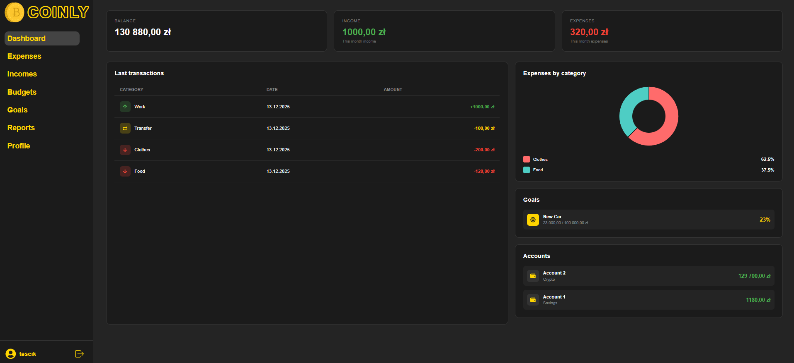
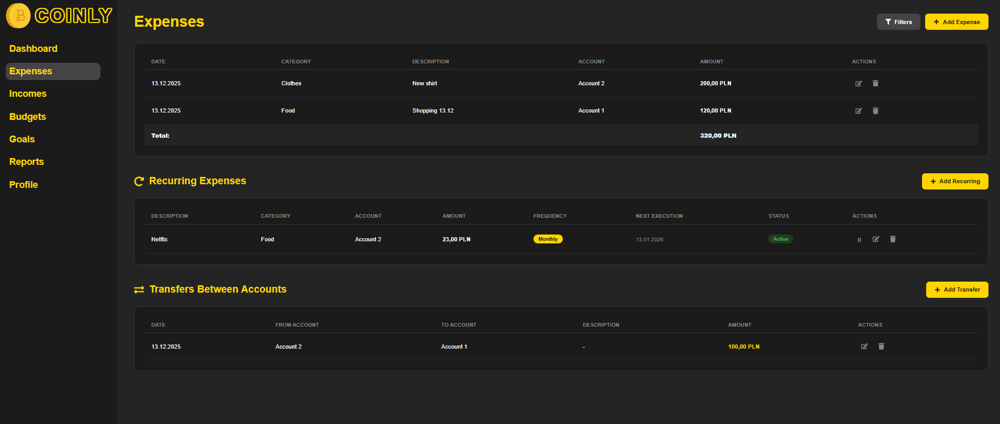
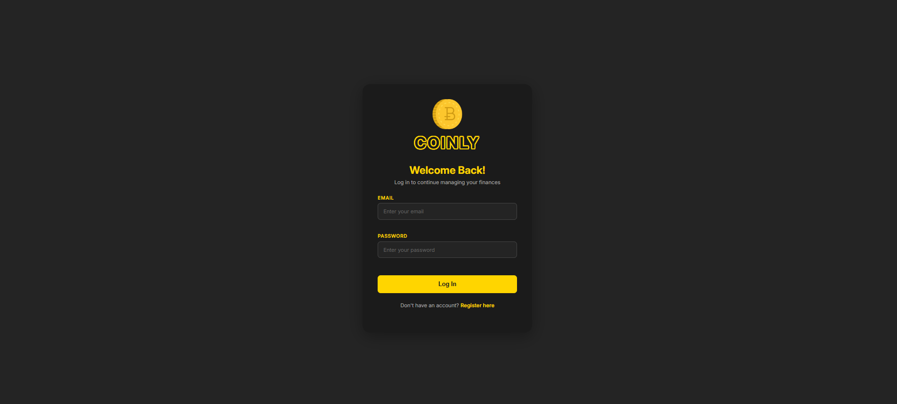

<p align="center">
  
</p>

<h1 align="center">💰 Coinly</h1>

<p align="center">
  <strong>Personal Finance Management Application</strong><br>
  <em>Bachelor's Degree Project</em>
</p>

<p align="center">
  
  
  
  
  
</p>

---

## 📋 Table of Contents

- [About](#-about)
- [Features](#-features)
- [Tech Stack](#-tech-stack)
- [Prerequisites](#-prerequisites)
- [Installation](#-installation)
- [Configuration](#-configuration)
- [Running the Application](#-running-the-application)
- [API Endpoints](#-api-endpoints)
- [Project Structure](#-project-structure)
- [Screenshots](#-screenshots)
- [License](#-license)

---

## 📖 About

**Coinly** is a full-stack personal finance management application designed to help users take control of their financial life. Track income and expenses, set budgets, define savings goals, analyze financial trends through detailed reports, and automate recurring transactions.

Built as a Bachelor's Degree Project, Coinly demonstrates modern web development practices with a clean architecture separating frontend and backend concerns.

---

## ✨ Features

### 💳 Transaction Management
- Add, edit, and delete income/expense transactions
- Categorize transactions for better organization
- Filter and search through transaction history
- View transaction statistics and summaries

### 📊 Budget Planning
- Create monthly/custom period budgets
- Set spending limits per category
- Track budget progress in real-time
- Receive alerts when approaching budget limits

### 🎯 Savings Goals
- Define financial goals with target amounts
- Track progress towards each goal
- Make deposits to goals from accounts
- Manage multiple savings accounts

### 📈 Financial Reports
- Monthly and yearly financial summaries
- Category-wise expense breakdown
- Income vs Expenses comparison charts
- Visual analytics with interactive charts

### 🔄 Recurring Transactions
- Set up automatic recurring income/expenses
- Support for daily, weekly, monthly, and yearly frequencies
- Toggle recurring transactions on/off
- Automated execution via scheduled cron jobs

### 📤 Import & Export
- Export financial data to Excel format
- Import transactions from external sources
- Data backup and restore capabilities

### 🔐 Security
- JWT-based authentication
- Secure password hashing with bcrypt
- Protected API routes
- Session management

### 🎨 User Experience
- Dark/Light theme support
- Responsive design
- Toast notifications
- Clean and intuitive interface

---

## 🛠 Tech Stack

### Backend
| Technology | Purpose |
|------------|---------|
| **Node.js** | Runtime environment |
| **Express.js 5** | Web application framework |
| **MySQL** | Relational database |
| **JWT** | Authentication tokens |
| **bcryptjs** | Password hashing |
| **node-cron** | Scheduled tasks |
| **ExcelJS** | Excel file generation |
| **Multer** | File upload handling |
| **express-validator** | Request validation |

### Frontend
| Technology | Purpose |
|------------|---------|
| **React 19** | UI library |
| **Vite** | Build tool & dev server |
| **React Router 7** | Client-side routing |
| **Axios** | HTTP client |
| **Recharts** | Data visualization |
| **Styled Components** | CSS-in-JS styling |
| **React Icons** | Icon library |
| **React Toastify** | Notifications |

---

## 📋 Prerequisites

Before you begin, ensure you have the following installed:

- **Node.js** (v18.0.0 or higher)
- **npm** (v9.0.0 or higher)
- **MySQL** (v8.0 or higher)
- **Git**

---

## 🚀 Installation

### 1. Clone the repository

```bash
git clone https://github.com/yourusername/coinly.git
cd coinly
```

### 2. Install Backend dependencies

```bash
cd Backend
npm install
```

### 3. Install Frontend dependencies

```bash
cd ../Frontend
npm install
```

### 4. Set up the database

Create a MySQL database for the application:

```sql
CREATE DATABASE coinly_db CHARACTER SET utf8mb4 COLLATE utf8mb4_unicode_ci;
```

---

## ⚙️ Configuration

### Backend Configuration

Create a `.env` file in the `Backend` directory:

```env
# Server Configuration
PORT=3000
NODE_ENV=development

# Database Configuration
DB_HOST=localhost
DB_PORT=3306
DB_USER=your_mysql_username
DB_PASSWORD=your_mysql_password
DB_NAME=coinly_db

# JWT Configuration
JWT_SECRET=your_super_secret_jwt_key_here
JWT_EXPIRES_IN=7d

# Client URL (for CORS)
CLIENT_URL=http://localhost:5173
```

### Frontend Configuration

Create a `.env` file in the `Frontend` directory:

```env
VITE_API_URL=http://localhost:3000/api
```

---

## ▶️ Running the Application

### Development Mode

**Start Backend server:**

```bash
cd Backend
npm run dev
```

The API server will start on `http://localhost:3000`

**Start Frontend development server:**

```bash
cd Frontend
npm run dev
```

The application will be available at `http://localhost:5173`

### Production Mode

**Build Frontend:**

```bash
cd Frontend
npm run build
```

**Start Backend in production:**

```bash
cd Backend
npm start
```

---

## 🔌 API Endpoints

### Authentication
| Method | Endpoint | Description |
|--------|----------|-------------|
| `POST` | `/api/auth/register` | Register new user |
| `POST` | `/api/auth/login` | User login |
| `GET` | `/api/auth/me` | Get current user |

### Transactions
| Method | Endpoint | Description |
|--------|----------|-------------|
| `GET` | `/api/transactions` | Get all transactions |
| `GET` | `/api/transactions/stats` | Get transaction statistics |
| `GET` | `/api/transactions/:id` | Get transaction by ID |
| `POST` | `/api/transactions` | Create transaction |
| `PUT` | `/api/transactions/:id` | Update transaction |
| `DELETE` | `/api/transactions/:id` | Delete transaction |

### Budgets
| Method | Endpoint | Description |
|--------|----------|-------------|
| `GET` | `/api/budgets` | Get all budgets |
| `GET` | `/api/budgets/:id` | Get budget by ID |
| `GET` | `/api/budgets/:id/status` | Get budget status |
| `POST` | `/api/budgets` | Create budget |
| `PUT` | `/api/budgets/:id` | Update budget |
| `DELETE` | `/api/budgets/:id` | Delete budget |

### Savings Goals
| Method | Endpoint | Description |
|--------|----------|-------------|
| `GET` | `/api/savings/goals` | Get all goals |
| `GET` | `/api/savings/goals/:id` | Get goal by ID |
| `POST` | `/api/savings/goals` | Create goal |
| `PUT` | `/api/savings/goals/:id` | Update goal |
| `DELETE` | `/api/savings/goals/:id` | Delete goal |
| `POST` | `/api/savings/goals/:id/deposit` | Deposit to goal |

### Savings Accounts
| Method | Endpoint | Description |
|--------|----------|-------------|
| `GET` | `/api/savings/accounts` | Get all savings accounts |
| `GET` | `/api/savings/accounts/:id` | Get account by ID |
| `POST` | `/api/savings/accounts` | Create account |
| `PUT` | `/api/savings/accounts/:id` | Update account |
| `DELETE` | `/api/savings/accounts/:id` | Delete account |

### Reports
| Method | Endpoint | Description |
|--------|----------|-------------|
| `GET` | `/api/reports/monthly` | Monthly report |
| `GET` | `/api/reports/yearly` | Yearly report |
| `GET` | `/api/reports/category` | Category report |
| `GET` | `/api/reports/income-vs-expenses` | Income vs Expenses |

### Recurring Transactions
| Method | Endpoint | Description |
|--------|----------|-------------|
| `GET` | `/api/recurring` | Get all recurring |
| `GET` | `/api/recurring/:id` | Get recurring by ID |
| `POST` | `/api/recurring` | Create recurring |
| `PUT` | `/api/recurring/:id` | Update recurring |
| `DELETE` | `/api/recurring/:id` | Delete recurring |
| `PATCH` | `/api/recurring/:id/toggle` | Toggle active status |

### Categories
| Method | Endpoint | Description |
|--------|----------|-------------|
| `GET` | `/api/categories` | Get all categories |
| `POST` | `/api/categories` | Create category |
| `PUT` | `/api/categories/:id` | Update category |
| `DELETE` | `/api/categories/:id` | Delete category |

### Accounts
| Method | Endpoint | Description |
|--------|----------|-------------|
| `GET` | `/api/accounts` | Get all accounts |
| `POST` | `/api/accounts` | Create account |
| `PUT` | `/api/accounts/:id` | Update account |
| `DELETE` | `/api/accounts/:id` | Delete account |

### Import/Export
| Method | Endpoint | Description |
|--------|----------|-------------|
| `GET` | `/api/export` | Export data |
| `POST` | `/api/import` | Import data |

---

## 📁 Project Structure

```
Coinly/
├── Backend/
│   ├── controllers/          # Request handlers
│   │   ├── authController.js
│   │   ├── transactionController.js
│   │   ├── budgetController.js
│   │   ├── savingsController.js
│   │   ├── reportController.js
│   │   └── ...
│   ├── database/
│   │   └── db.js             # Database connection
│   ├── middleware/
│   │   ├── authMiddleware.js # JWT verification
│   │   ├── errorHandler.js   # Error handling
│   │   └── validationMiddleware.js
│   ├── routes/               # API route definitions
│   │   ├── authRoutes.js
│   │   ├── transactionRoutes.js
│   │   └── ...
│   ├── services/             # Business logic
│   │   ├── authService.js
│   │   ├── transactionService.js
│   │   └── ...
│   ├── utils/
│   │   ├── bcrypt.js         # Password utilities
│   │   ├── jwt.js            # Token utilities
│   │   ├── cronService.js    # Scheduled tasks
│   │   └── responseFormatter.js
│   ├── tests/
│   │   └── utils.test.js
│   ├── server.js             # Application entry point
│   └── package.json
│
├── Frontend/
│   ├── public/               # Static assets
│   │   ├── coinly.svg
│   │   └── coinly.png
│   ├── src/
│   │   ├── api/              # API services
│   │   │   ├── axios.js
│   │   │   └── dashboardService.js
│   │   ├── Assets/           # Images and media
│   │   ├── Components/       # Reusable components
│   │   │   ├── LeftBar/
│   │   │   ├── StatCard/
│   │   │   └── ProtectedRoute/
│   │   ├── context/          # React contexts
│   │   │   ├── AuthContext.jsx
│   │   │   └── ThemeContext.jsx
│   │   ├── Layouts/
│   │   │   └── MainLayout/
│   │   ├── Routes/           # Page components
│   │   │   ├── DashboardPage/
│   │   │   ├── ExpensesPage/
│   │   │   ├── IncomesPage/
│   │   │   ├── BudgetPage/
│   │   │   ├── GoalPage/
│   │   │   ├── ReportPage/
│   │   │   ├── ProfilePage/
│   │   │   ├── LoginPage/
│   │   │   ├── RegisterPage/
│   │   │   └── WelcomePage/
│   │   ├── styles/
│   │   ├── utils/
│   │   ├── main.jsx          # Application entry point
│   │   └── index.css
│   ├── index.html
│   ├── vite.config.js
│   └── package.json
│
└── README.md
```

---

## 🖼 Screenshots

<p align="center">
  <em>Screenshots coming soon...</em>
</p>







---

## 🧪 Testing

Run backend tests:

```bash
cd Backend
npm test
```

---

## 🤝 Contributing

1. Fork the repository
2. Create your feature branch (`git checkout -b feature/AmazingFeature`)
3. Commit your changes (`git commit -m 'Add some AmazingFeature'`)
4. Push to the branch (`git push origin feature/AmazingFeature`)
5. Open a Pull Request

---

## 📄 License

This project is licensed under the ISC License.

---

## 👤 Author

**Bachelor's Degree Project**

---

<p align="center">
  Made with ❤️ and ☕
</p>
